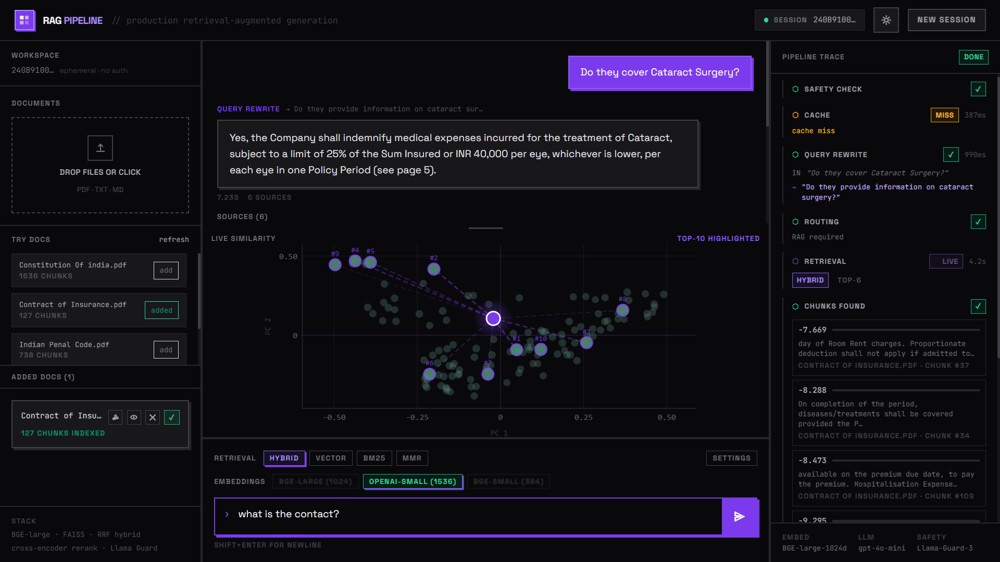
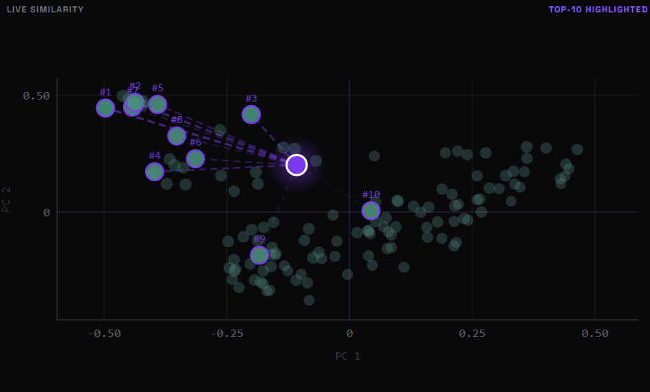
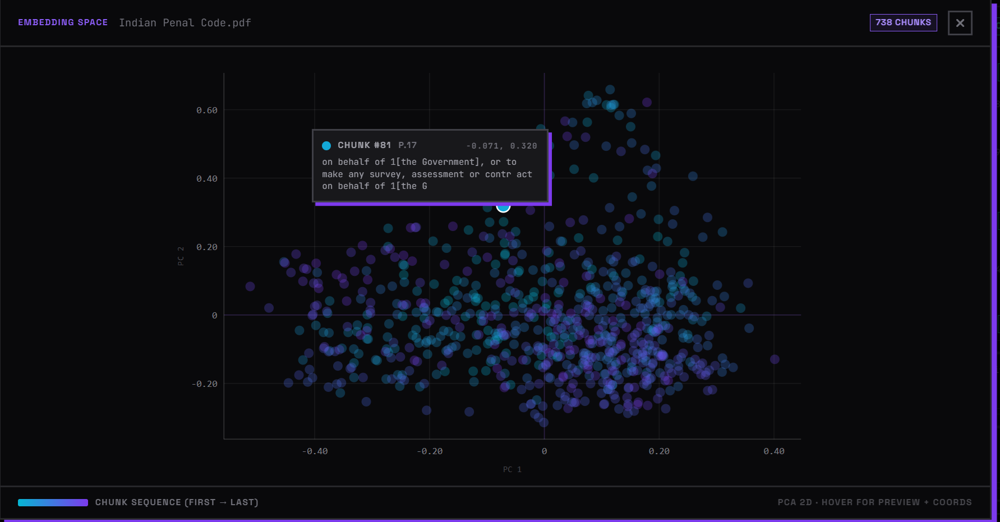
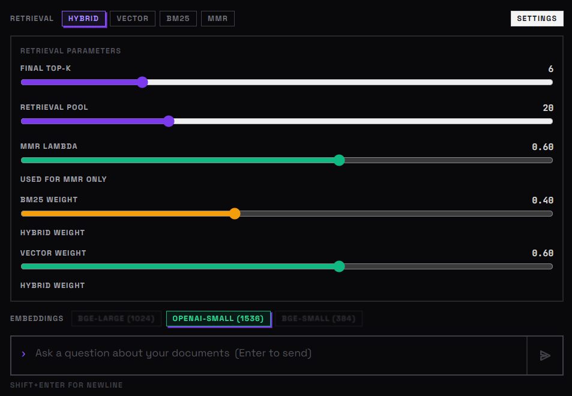

# SeeRAG Frontend



A polished React + Vite frontend for [SeeRAG](https://seerag.vercel.app) (Live Link)
- Backend Repo: <https://github.com/Sambhaji-Patil/SeeRag-Backend>

This app is the presentation layer only. All AI/ML logic lives in the backend.

## What This Frontend Does

- Hosts the chat experience and session workflow.
- Lets users upload documents and manage the workspace.
- Streams the backend pipeline step by step.
- Exposes retrieval controls for top-k, MMR, and hybrid weighting.
- Visualizes the embedding space and live query similarity.
- Shows the full RAG trace so the pipeline is easy to inspect.

## Visual Features

### Main Screen


### Live Similarity Graph

The query similarity graph projects chunk embeddings into a 2D PCA space and shows how the current query relates to the stored chunks.



- The backend returns chunk embeddings and query similarity scores.
- The frontend renders the data as a live scatter plot.
- The highlighted chunks are kept in place and blink to show relevance.

### Embedding Space Modal

The embedding viewer opens a PCA-based map of the document embedding space.



- Each chunk is rendered as a point in 2D.
- Hovering a point shows the chunk preview and coordinates.
- This helps explain how the document was split and organized.

### Pipeline Trace

The pipeline panel animates the backend execution flow.


- Guardrails
- Cache hit or miss
- Query rewrite
- Routing decision
- Retrieval
- Context building
- Generation

### Settings Panel



## Design Notes

- The UI uses a split-panel workspace to keep chat, documents, and pipeline trace visible at the same time.
- Visualizations are intentionally interactive so the retrieval process is easy to understand.
- The frontend handles presentation only; model calls, retrieval, caching, and ranking remain in the backend.

## Tech Stack

- React 18
- Vite
- TypeScript
- Tailwind CSS
- Framer Motion
- React Markdown

## Development

Install dependencies:

```bash
npm install
```

Run locally:

```bash
npm run dev
```

Build for production:

```bash
npm run build
```

Preview the production build:

```bash
npm run preview
```

## Environment Variables

- `VITE_API_URL` optional, defaults to the hosted backend.
- `VITE_API_BEARER_TOKEN` required when the backend auth secret is enabled.

## Deployment

This frontend is deployed on Vercel.

- Live site: <https://seerag.vercel.app>
- Frontend repo: <https://github.com/Sambhaji-Patil/seerag-frontend>
- Backend repo: <https://github.com/Sambhaji-Patil/SeeRag-Backend>

## Backend Integration

The frontend calls the backend for:

- document upload
- query execution
- pipeline streaming
- collection visualization
- query similarity projection

The backend handles:

- retrieval
- embeddings
- reranking
- caching
- safety checks
- answer generation

## Notes

If you want the best live demo experience, keep the backend and frontend secrets aligned:

- `API_BEARER_TOKEN` in Hugging Face
- `VITE_API_BEARER_TOKEN` in Vercel
